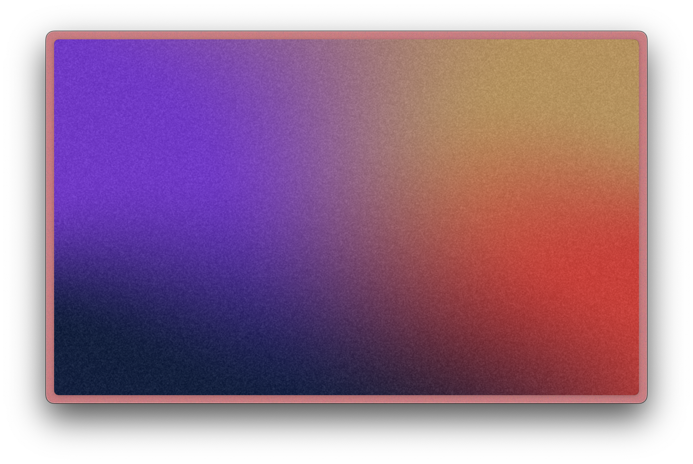
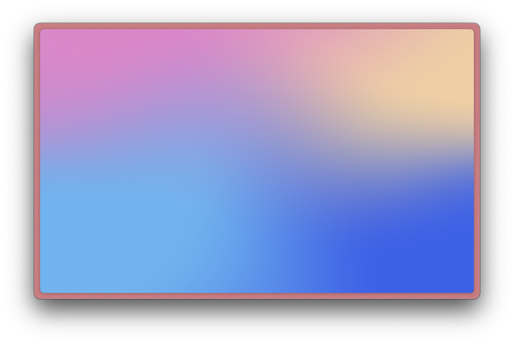

<div align="center">
    
    <h3><kbd>ShaderToy</kbd> ❯❯ <kbd>WebGL2</kbd></h3>
    
</div>

## Installation

```bash
# Install globally
npm install -g shadertoy2webgl

# Or use npx (no installation needed)
npx shadertoy2webgl <shader-id> [<shader-id>...]

# Or install as a project dependency
npm install shadertoy2webgl
```

## CLI Usage

```bash
# Using global installation
shadertoy2webgl <shader-id> [<shader-id>...]
# or
st2webgl <shader-id> [<shader-id>...]

# Using npx (no installation needed)
npx shadertoy2webgl <shader-id> [<shader-id>...]

# Example with multiple shaders
shadertoy2webgl MdX3Rr wdyczG DdcfzH

# Force overwrite existing directories
shadertoy2webgl --force <shader-id> [<shader-id>...]
```

## Library Usage

```javascript
import { shadertoy2webgl } from 'shadertoy2webgl';

// Convert a shader and get paths to generated files
const { html, js } = await shadertoy2webgl('shader-id');
console.log(html, js);

// Example with error handling
try {
    const { html, js } = await shadertoy2webgl('MdX3Rr');
    console.log('Generated files:', { html, js });
} catch (error) {
    console.error('Failed to process shader:', error.message);
}
```

## Features

- Converts ShaderToy shaders to WebGL2
- Handles ShaderToy-specific uniforms (iResolution, iTime, iFrame, iMouse)
- Generates web-compatible HTML and JavaScript
- Zero dependencies
- Modern WebGL2 support
- ESM module support
- Works with Node.js >= 18

## Demos

We provide two sample demos showcasing different shader effects:

<table><tr>
<td></td>
<td>
<code>st2webgl wdyczG</code><br/>
<a href="demo/wdyczG/index.html">demo/wdyczG/index.html</a><br/>
<i><a href="https://www.shadertoy.com/view/wdyczG">shadertoy.com/view/wdyczG</a></i><br/>
</td>
</tr></table>

<table><tr>
<td></td>
<td>
<code>st2webgl DdcfzH</code><br/>
<a href="demo/DdcfzH/index.html">demo/DdcfzH/index.html</a><br/>
<i><a href="https://www.shadertoy.com/view/DdcfzH">shadertoy.com/view/DdcfzH</a></i><br/>
</td>
</tr></table>

## Output

The tool generates files in a directory named after the shader ID:
- `index.html`: A standalone HTML file with the shader
- `shader.js`: The WebGL2 shader code
- `shader.json`: Shader metadata and code

If any directory already exists, the tool will refuse to overwrite it unless the `--force` flag is used:

```bash
# Overwrite existing directories
shadertoy2webgl --force <shader-id> [<shader-id>...]
```

## Testing

```bash
# Run tests
npm test

# Run tests with coverage (requires Node.js >= 20)
node --test --coverage test/
```

The test suite verifies:
- Shader fetching and conversion
- File generation
- Error handling
- Output validation
- Uniform handling


## License

[MIT](LICENSE)